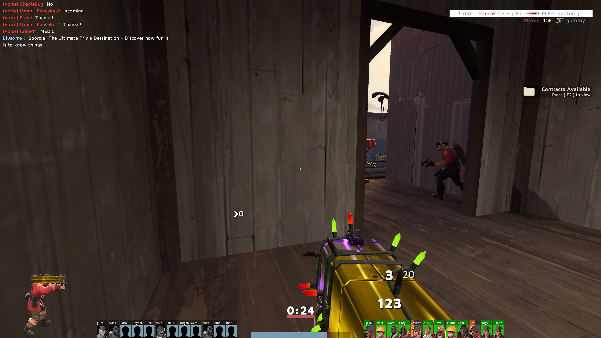

# THESOLUTION CROSSHAIR

This repository contains custom content for Team Fortress 2, a first-person shooter title by Valve Software. It replaces the crosshair for all mercenaries and their weapons with a small, minimal hollow cross, composed of four orthogonal rectangles with edges resting on the perimeter of the square center hole, such that the innermost two corners touch their neighbors.

I have found it quite effective; it allows me to maintain higher overall accuracy with all weapons. Let me know what you think!

## THESOLUTION - WHAT YOU GET

Here is an image of `thesolution.{vmt|vtf}` being used in game, on the map `pl_badwater`. I am using a yellow crosshair (`0xFFFF00`), but you may choose any color:

## THESOLUTION - DEPENDENCIES

For scripted (automatic) installation, you should have Python (tested and working on Python 3.13.14, but other versions will most likely work). The installation script(s) assume a Windows 11 machine, running on the `Default Public Version` build released on July 16, 2026. Execution of the installer should be done using the provided [Windows batchfile](https://en.wikipedia.org/wiki/Batch_file).

## THESOLUTION - INSTALLATION

1. Close TF2.
2. Clone this repository (or, if packaged into an archive, unpackage) anywhere.
3. Double-click INSTALL.bat (if publisher verification warning appears, click yes)
4. It finds TF2 and asks one question. Say yes.
5. Open TF2.

Done. You now have `thesolution.{vmt|vtf}` as your active crosshair for all classes and weapons.

## THESOLUTION - WHAT ELSE?

That's it. It won't touch anything until it's sure it can finish, so if
something goes wrong you're back where you started and can just re-run it. If it does fail for whatever reason, see the section below.

## THESOLUTION - TROUBLESHOOTING AND CONFIGURATION

**NO PYTHON?**
1. INSTALL.bat will tell you.
2. Get it from python.org/downloads and TICK "Add python.exe to PATH" during setup.
3. Then run INSTALL.bat again.

**IT COULDN'T FIND TF2?**
1. Steam -> right-click TF2 -> Manage -> Browse local files.
2. Copy the address bar, paste it in when it asks.

**CROSSHAIR NOT SHOWING?**
1. Console (~ key):
    `cl_crosshair_file ""`
    `crosshair 1`
2. Restart the game. If `~` does nothing:
    Options -> Keyboard -> Advanced -> tick "Enable developer console"
3. If the console still refuses to appear, it is possible that you re-bound the `toggleconsole` key away from its default, which is `~`.
4. If you suspect that this may be the case, you can re-bind it via:
    Options -> Keyboard -> scroll to Miscellaneous -> {read the current assigned key | click the associated option to re-bind it}

**COLOR - console, persists selection (example YELLOW):**
1. `cl_crosshair_red 255`
2. `cl_crosshair_green 255`
3. `cl_crosshair_blue 0`
4. `cl_crosshairalpha 200`

If it isn't working and the information above cannot remediate the issue, please see [the MORE section](#thesolution---notes).

## THESOLUTION - UNINSTALLATION

1. Delete `tf\custom\thesolution` (the installer prints the exact path when it finishes)
2. To undo the config bit too: `tf\cfg\autoexec.cfg`, delete the two lines under `// thesolution crosshair`.

## THESOLUTION - NOTES

   - Safe on VAC. It's an image + text files in TF2's own custom folder.
   - Works alongside custom HUDs.
   - Your autoexec.cfg gets backed up to autoexec.cfg.bak before any change.
   - A few community servers (`sv_pure 2`) force default crosshairs. Casual is fine.
   - Re-running it is harmless, it just reinstalls.

### THESOLUTION - MORE

If you appreciate this service to the community, please consider checking out my [personal webpage](https://www.dconn.dev/) (`https://www.dconn.dev/`), and/or following me on GitHub (`dylantcon`). Thanks!

**Bugs or other problems**: Contact me if you run into any issues with this custom crosshair regardless of whether it's during installation or actual TF2 gameplay. I can be reached via email at `dtc22h@fsu.edu` and `dylan.t.con@gmail.com`, and will do my best to fix it for you.
